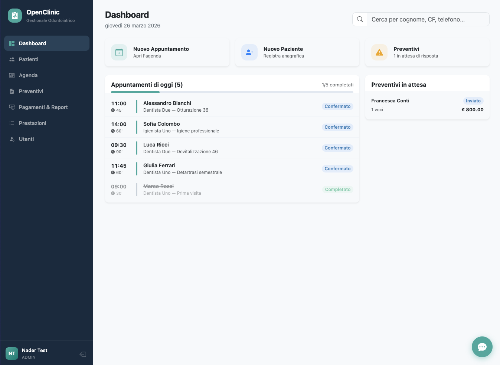
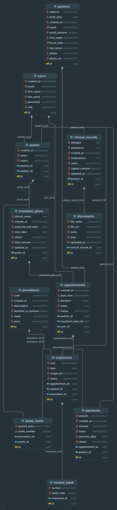

# OpenClinic — Backend

REST API for OpenClinic, a dental practice management system built as an EPICODE bootcamp capstone project.

> The frontend repository is available at [Capstone-Frontend](https://github.com/N4D3RR/openclinic-fe)

---

## Screenshots



---

## Tech Stack

|                |                                  |
|----------------|----------------------------------|
| Language       | Java 21                          |
| Framework      | Spring Boot 4                    |
| Persistence    | Spring Data JPA + Hibernate      |
| Database       | PostgreSQL                       |
| Security       | Spring Security + JWT (JJWT)     |
| PDF Generation | OpenPDF (invoices, quotes)       |
| File Storage   | Cloudinary                       |
| Email          | Mailgun                          |
| AI             | OpenRouter API                   |
| API Docs       | Springdoc OpenAPI 3 / Swagger UI |
| Build          | Maven                            |

---

## Features

### Core

- **Patient management** — full registry with fiscal code, contacts, photo upload (Cloudinary), email consent
- **Appointments** — calendar with conflict detection, date range queries, role-scoped visibility
- **Clinical records** — per-visit notes with document attachments (Cloudinary)
- **Procedures** — catalog with code, price, and duration
- **Quotes** — multi-item quotes per patient/tooth; status flow: `DRAFT → SENT → ACCEPTED / REJECTED`
- **Treatment plans** — auto-generated on quote acceptance, auto-completed when all appointments are done
- **Payments** — tracking with method, status, monthly KPIs, invoice PDF download

### Integrations

- **Cloudinary** — patient photos and clinical document storage
- **Mailgun** — appointment confirmation emails + automated daily reminders (18:00 cron)
- **OpenPDF** — invoice generation with progressive numbering per year
- **OpenRouter AI** — conversational assistant with real-time studio context (patient count, today's appointments)

---

## Architecture

```
src/main/java/naderdeghaili/capstoneproject/
├── entities/          # JPA entities + enums
├── repositories/      # Spring Data JPA repositories
├── services/          # Business logic
├── controllers/       # REST controllers (@PreAuthorize for role control)
├── payloads/
│   ├── create/        # Create DTOs (records + Jakarta validation)
│   ├── update/        # Update DTOs (nullable fields for partial updates)
│   └── responses/     # Response DTOs
├── security/          # JWT tools, filter, Spring Security config
├── exceptions/        # Custom exceptions + global error handler
├── Jobs/              # @Scheduled jobs (email reminders)
└── runners/           # CommandLineRunner (default admin seed)
```

### Data Model



---

### Key architectural decisions

**Two-level role-based security**: `@PreAuthorize` on controllers for role enforcement; `checkOwnership()` in services
to ensure DENTIST users access only their own resources.

**Circular dependency resolution**:

- `TreatmentPlanService` ↔ `AppointmentService`: resolved with `@Lazy` on one side
- `PasswordEncoderConfig` is a separate `@Configuration` class (not inside `SecurityConfig`) to avoid a cycle through
  `UserService`
- `JWTCheckerFilter` is injected as a method parameter in `sfc()`, not via constructor

**Auto-generated TreatmentPlan**: when a Quote transitions to `ACCEPTED`, the service automatically creates a
`TreatmentPlan` with total amount and estimated end date based on procedure durations.

**Auto-completed TreatmentPlan**: when all appointments in a plan reach `COMPLETED` status, the plan is closed
automatically.

**Bidirectional JPA `toString()`**: uses IDs only to prevent `StackOverflowError` on circular references.

**Spring Boot 4 + Jackson 3**: `LocalDateTime` serializes as ISO string by default.

---

## Roles & Permissions

| Feature         | ADMIN | SECRETARY | DENTIST   | HYGIENIST |
|-----------------|-------|-----------|-----------|-----------|
| Patients (CRUD) | ✅     | ✅         | ✅         | Read only |
| Appointments    | All   | All       | Own only  | Own only  |
| Quotes          | All   | All       | Own only  | —         |
| Treatment Plans | ✅     | ✅         | ✅         | ✅         |
| Payments        | ✅     | ✅         | —         | —         |
| Users (CRUD)    | ✅     | —         | —         | —         |
| Procedures      | ✅     | ✅         | Read only | Read only |

---

## Local Setup

### Prerequisites

- Java 21+
- PostgreSQL 15+
- Maven 3.9+

The backend runs on `http://localhost:3004` by default.
Swagger UI: `http://localhost:3004/swagger-ui.html`

### 1. Create the database

```sql
CREATE DATABASE OpenClinic;
```

### 2. Configure environment

The app reads configuration from environment variables. For local development,
create `src/main/resources/application.properties`:

```properties
# Server
server.port=${PORT}
# Database
spring.datasource.url=jdbc:postgresql://localhost:5432/${PG_DB_NAME}
spring.datasource.username=${PG_USERNAME}
spring.datasource.password=${PG_PASSWORD}
spring.jpa.hibernate.ddl-auto=update
# JWT
jwt.secret=${JWT_SECRET}
# Cloudinary
cloudinary.name=${CLOUDINARY_NAME}
cloudinary.apikey=${CLOUDINARY_API_KEY}
cloudinary.secret=${CLOUDINARY_SECRET}
# Mailgun
mailgun.domain=${MAILGUN_DOMAIN}
mailgun.apiKey=${MAILGUN_API_KEY}
# OpenRouter (AI)
openrouter.api.key=${OPENROUTER_API_KEY}
openrouter.model=stepfun/step-3.5-flash:free
```

Set the following environment variables in your `.env` file:

| Variable                 | Description                |
|--------------------------|----------------------------|
| `PORT`                   | Server port (e.g. `3004`)  |
| `PG_DB_NAME`             | PostgreSQL database name   |
| `PG_USERNAME`            | PostgreSQL username        |
| `PG_PASSWORD`            | PostgreSQL password        |
| `JWT_SECRET`             | Secret key for JWT signing |
| `CLOUDINARY_NAME`        | Cloudinary cloud name      |
| `CLOUDINARY_API_KEY`     | Cloudinary API key         |
| `CLOUDINARY_SECRET`      | Cloudinary API secret      |
| `MAILGUN_DOMAIN`         | Mailgun sandbox domain     |
| `MAILGUN_API_KEY`        | Mailgun API key            |
| `OPENROUTER_API_KEY`     | OpenRouter API key         |
| `ADMIN_DEFAULT_EMAIL`    | Default admin email        |
| `ADMIN_DEFAULT_PASSWORD` | Default admin password     |

### 3. Run

```bash
./mvnw spring-boot:run
```

On first startup, `AdminRunner` creates a default admin account:

| Field    | Value           |
|----------|-----------------|
| Email    | `admin@test.it` |
| Password | `Admin1234`     |

> **Note:** remove or protect the `AdminRunner` seed before deploying to production.


---

## Production

Once deployed on Render, replace `localhost:3004` with your Render service URL.

---

## API Documentation

Swagger UI is available at:

```
http://localhost:3004/swagger-ui.html
```

To import into Postman, fetch the OpenAPI spec:

```
GET http://localhost:3004/v3/api-docs
```

### Authentication

All endpoints except `/auth/**` require a Bearer token:

```
Authorization: Bearer <token>
```

Obtain a token via:

```
POST /auth/login
Content-Type: application/json

{ "email": "admin@test.it", "password": "Admin1234" }
```

The response contains `accessToken`.

---

## Main Endpoints

| Method | Path                           | Description                                       |
|--------|--------------------------------|---------------------------------------------------|
| POST   | `/auth/login`                  | Login                                             |
| GET    | `/api/patients`                | All patients (paginated)                          |
| GET    | `/api/patients/:id`            | Patient detail                                    |
| GET    | `/api/appointments/date-range` | Appointments by date range                        |
| POST   | `/api/quotes`                  | Create quote                                      |
| PUT    | `/api/quotes/:id`              | Update quote (triggers TreatmentPlan on ACCEPTED) |
| GET    | `/api/payments/kpi`            | Payment KPIs + monthly revenue                    |
| GET    | `/api/payments/:id/invoice`    | Download invoice PDF                              |
| POST   | `/api/ai/chat`                 | AI assistant chat                                 |

Full reference available on Swagger UI.

---

## Author

Nader Deghaili — EPICODE Capstone Project 2026